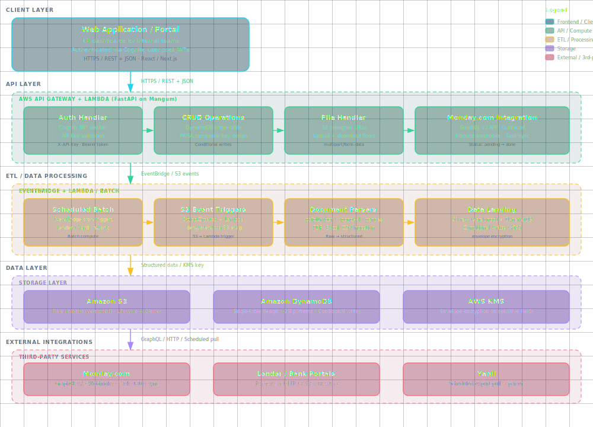

# Senior Python Backend Engineer — AWS Asset & Portfolio Mgmt Platform

> Reference implementation. See [SPEC.md](./SPEC.md) for the full job specification,
> business problem, and acceptance criteria.

## Business Problem Solved

The client is building a **cloud-based asset and portfolio management platform** that connects three messy domains — financial reporting data, property management systems (Yardi, Excel-based reports), and workflow automation tools (Monday.com) — into a single source of truth their internal teams use every day. The architecture is already defined (AWS-native, DynamoDB single-table, S3 raw landing zone, Cognito/IAM auth, Monday integration layer, ETL pipeline tier). What they need now is a senior backend engineer who can **implement to the spec** — building services, ETL jobs, and integrations against an agreed-upon design without re-architecting from scratch.

Without this role, their internal portal sits half-built and the integrations between lender reports, Yardi exports, and Monday workflows stay manual — every property search becomes a multi-tool fire drill for the operations team.

---

## Scope

The system has three layers; the role owns the implementation of all of them.

### 1. **Backend API (AWS-native)**
- FastAPI / Flask REST endpoints behind AWS Cognito / IAM auth
- File upload/download to S3 with proper presigned-URL flow
- Read/write of core structured data in DynamoDB (single-table design)
- Task create/update calls into Monday.com
- Webhook receiver for Monday status sync

### 2. **ETL / Data Processing Tier (event-driven + batch)**
- Scheduled / triggered jobs (AWS Lambda / Batch) that:
  - Import reports from lenders/banks (PDF, CSV, XLSX)
  - Import reports from property manager systems (Yardi exports, Excel)
  - Parse financial data (totals, balances, line items, dates)
  - Land raw files in S3 with metadata
  - Write structured records into DynamoDB

### 3. **Integration Layer (Monday.com)**
- Outbound: push tasks and updates from the platform to Monday
- Inbound: receive webhook updates from Monday and synchronise task status back to the platform

### 4. **Cross-cutting Responsibilities**
- DynamoDB data model design (single-table, access patterns first)
- Secure authentication (Cognito user pools + IAM roles for service-to-service)
- Structured logging, CloudWatch metrics, error handling with retry/backoff
- Documentation (OpenAPI spec, runbooks, data dictionary)

---

## 🏗 Technical Stack

| Category | Tech |
|---|---|
| **Languages** | Python (primary) |
| **Compute** | AWS Lambda, AWS Batch |
| **Storage** | DynamoDB (single-table), S3 |
| **Auth** | AWS Cognito, IAM |
| **API** | FastAPI / Flask, REST/JSON |
| **Data formats** | JSON, CSV, Excel (openpyxl / pandas), PDF parsing |
| **Patterns** | ETL pipelines, event-driven architecture, serverless |

### Strongly Preferred

- **Monday.com API** integration
- **Yardi / property management data** familiarity
- **Terraform / CDK** for infrastructure-as-code

### Nice to Have

- Financial-data domain experience (REIT, fund admin, accounting)
- BI/dashboard layer (QuickSight, Tableau)

---


## Architecture



> **Live diagram:** open [`diagrams/architecture.svg`](./diagrams/architecture.svg) in any browser for the full interactive version.

### Component Overview

| Layer | Component | Description |
|---|---|---|
| **Client** | Web Application / Portal | KPI dashboards · React/Next.js · Cognito JWT auth |
| **API** | API Gateway + Lambda | FastAPI on Mangum · Cognito JWT · DynamoDB CRUD |
| **API** | File Handler | S3 presigned URLs · upload + download |
| **API** | Monday.com Integration | GraphQL v2 · outbound + inbound webhooks |
| **ETL** | Scheduled Batch | EventBridge cron · lender/Yardi imports · Batch.compute |
| **ETL** | S3 Event Triggers | ObjectCreated → Lambda · idempotent via etag |
| **ETL** | Document Parsers | pdfplumber · openpyxl · pandas |
| **Data** | Amazon S3 | Versioned raw uploads · lifecycle → Glacier |
| **Data** | Amazon DynamoDB | Single-table design · GSI · conditional writes |
| **Data** | AWS KMS | Envelope encryption on sensitive fields |
| **External** | Monday.com | GraphQL v2 · task status sync |
| **External** | Lender / Bank Portals | Per-vendor HTTP/CSV connectors |
| **External** | Yardi | Scheduled export pull + parser |

---

## ✅ Acceptance Criteria

A working implementation must demonstrate:

1. **One end-to-end flow working** — at minimum: file upload → S3 → parse → DynamoDB → API read. Live, not mocked.
2. **Auth working** — Cognito user pool + JWT-protected API endpoint; IAM role for service-to-service
3. **DynamoDB single-table model** — designed for ≥3 access patterns, with GSIs where required
4. **ETL job** — one scheduled Lambda that ingests a real (or realistic) Yardi/Excel export into DynamoDB
5. **Monday.com integration** — outbound task creation from the API → Monday, with a sample status sync
6. **Observability** — CloudWatch structured logs, custom metric on at least one ETL job, alert on parse failure
7. **Tests** — pytest with ≥70% coverage on the API + parser layers
8. **IaC** — Terraform or CDK module that provisions the entire stack from scratch

---


## 🚀 Quick Start

```bash
git clone https://github.com/9KMan/JOB-20260626153537-000112.git
cd JOB-20260626153537-000112
# See SPEC.md §"How You'll Work" for the canonical run/build commands
docker compose up --build   # if a Dockerfile is present
```

API ready at: `http://localhost:8000/health` (when the FastAPI service is running).

## 📦 What's in this repo

- `SPEC.md` — full job specification (source of truth)
- `ROADMAP.md` — phased delivery plan
- `CLAUDE.md` — operating notes for AI build workers
- `app/` — application source
- `alembic/` — database migrations (where applicable)
- `Dockerfile`, `docker-compose.yml` — container build
- `.planning/phases/` — per-phase plan + summary files
